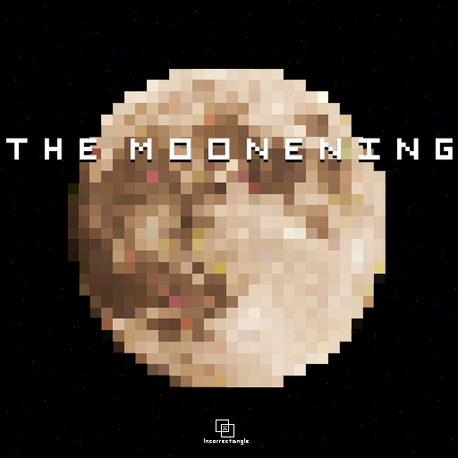

THE MOONENING
=============

Synopsis
--------
A moon settlement is sending a faint distress signal to Earth. A four person team is deployed from one of Earth's satellite bases to investigate the nature of the SOS. After penetrating the colony dome they find the settlement abandoned, but as the team works their way into the colony's spooky infrastructure they encounter formidable evil.

Gameplay
--------
This is a top down, turn based adventure. It combines fun multiplayer dungeon crawling with a spooky space feel.
The player controls the four investigators simultaneously using each of their unique powers to overcome obstacles, monsters and bosses. 

Why it satisfies github's theme requirements
--------------------------------------------
The four investigators' special powers are

* Telekinetic push
* Telekinetic pull
* Time reset
* Character clone

Style, theme, and other inspirations
--------------------------------
Moon (moon)

Zelda (layout)  

Nitrome's Tournament (layout, turns, feel) 
click to play 

Metroid (music, level design) 

Battletoads (humor, hey, it's space)  

This fictional 8bit Metal Gear Solid (color, buildings) 

Flashback (colors, tileset)

 

 

 

 

Le Scaphandrier (8bit fog of war)

